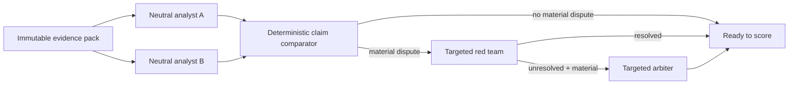
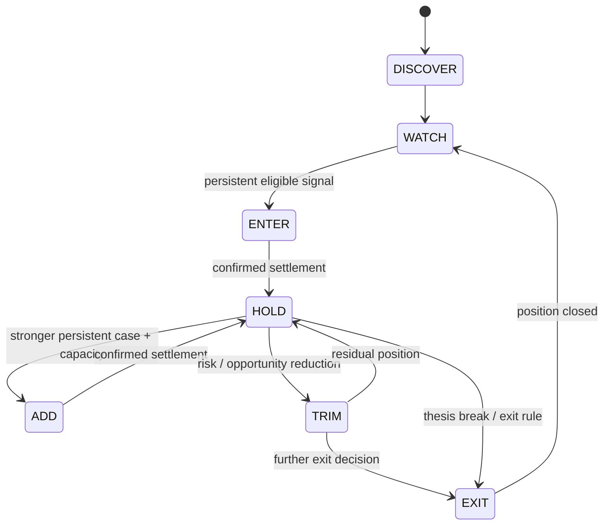
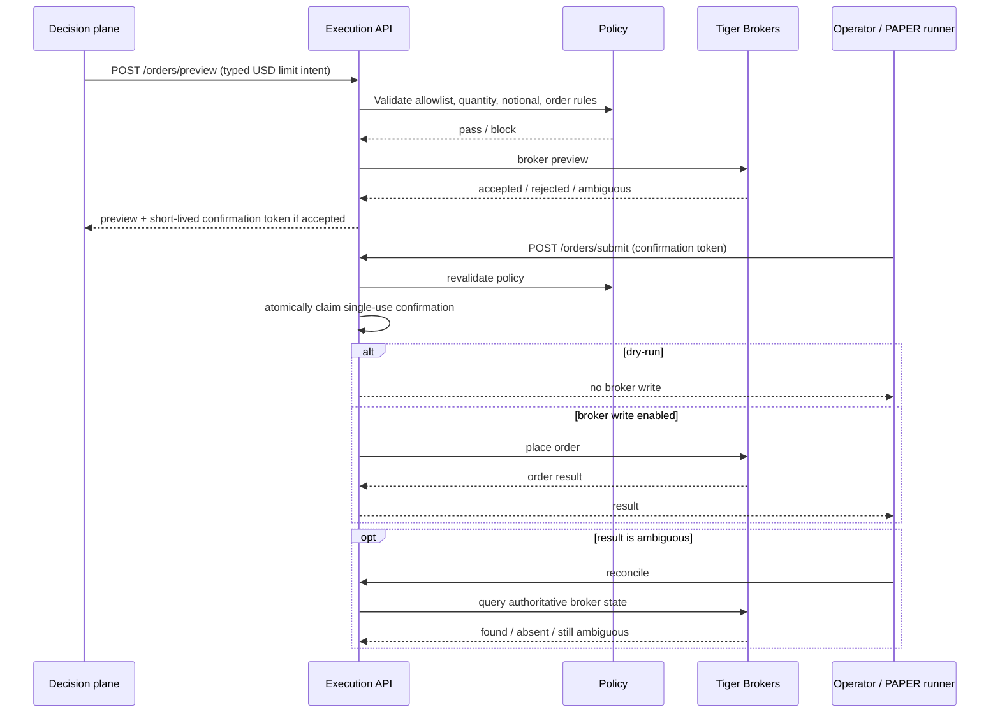

<p align="center">
  
</p>

<h1 align="center">Tiger TradeHub</h1>

<p align="center"><strong>Evidence-aware research. Deterministic decisions. Guarded execution.</strong></p>

Tiger TradeHub is a local-first, low-touch US-equity research, validation, portfolio-decision, and guarded-execution system built around Tiger Brokers. Its purpose is not to let an AI model "trade on vibes". It separates the parts of investing that benefit from interpretation from the parts that should be deterministic, replayable, constrained, and auditable.

> [!IMPORTANT]
> **Current status — Forward Observation Mode.** The investment-decision logic is frozen while genuine forward outcomes mature. The deployed execution path remains dry-run, and the repository makes **no claim of validated investment alpha** yet. The validation machinery is operational; the investment evidence is still insufficient. This project is experimental infrastructure, not financial advice.

The governing rule is simple:

> **Models interpret. Code measures. Evidence decides what can be claimed. Deterministic policy decides what can be acted on.**

## What TradeHub aims to do

TradeHub is designed to become a boring, reliable investment operating system that can run with little day-to-day intervention:

1. collect public market and company evidence with point-in-time provenance;
2. screen a broad US-equity universe cheaply and deterministically;
3. spend model calls only on the smaller set of candidates where interpretation may add value;
4. turn evidence and structured assessments into deterministic scores, trajectory, portfolio states, sizing, and typed proposals;
5. pass any executable proposal through a separate, hardened Tiger execution boundary;
6. reconcile against the broker rather than inventing its own accounting truth;
7. continuously record predictions and later outcomes so the system can prove whether its own ideas actually worked.

The intended result is **low touch, not low control**. No-action and cash are valid outputs. Models never receive Tiger credentials and are never the privileged broker-write actor.

## Current system at a glance

| Capability | Current implementation |
|---|---|
| Guarded Tiger bridge | Implemented: local FastAPI service, bearer auth, policy checks, preview, short-lived single-use confirmation, submit, cancel, audit, and indeterminate-order reconciliation. |
| Research evidence plane | Implemented: separate research process/database with SEC and Tiingo adapters, point-in-time evidence, security identity, universe membership, and backfill tooling. |
| Deterministic screening | Implemented: valuation, fundamental-inflection, quality, informed-activity, and event/catalyst Hunters, with momentum as a supporting signal. |
| Model committee | Implemented as a narrow research-only workflow: immutable evidence packs, two neutral analysts, deterministic comparison, targeted red-team/arbiter escalation, and structured assessment storage. Models are called externally through the authorized work surface; they do not scan the whole universe or trade. |
| Portfolio decision plane | Implemented: score/quality inputs, immutable observations, seven-state portfolio state machine, risk checks, sizing, activity budgets, and typed trade proposals. |
| PAPER autonomy | Implemented as deterministic code, not an LLM agent. It revalidates PAPER status, policy, freshness, allowlists, holdings, budgets, exposure, and the kill switch before using the existing execution path. |
| Validation | Implemented: frozen snapshots, replay, baselines, ablations, walk-forward evaluation, sealed holdout, look-ahead canaries, and append-only experiment records. |
| Forward observation | Active: production predictions are captured before outcomes exist and later matured at 21/63/126/252-session horizons. |
| Live autonomous trading | **Not the current operating mode.** Forward Observation Mode currently keeps broker writes dry-run while evidence matures. |

## Architecture

```mermaid
flowchart LR
    subgraph Sources["Public evidence"]
        SEC[SEC filings / Form 4 / company facts]
        MKT[Tiingo market data]
    end

    subgraph Research["Research plane — no Tiger credentials"]
        ING[Ingestion + PIT evidence ledger]
        UNI[Point-in-time universe]
        HUNT[Deterministic Hunters]
        FUNNEL[Candidate funnel]
        PACK[Immutable evidence packs]
        COMMITTEE[Model committee\nneutral A + neutral B\nred team / arbiter only when needed]
    end

    subgraph Decision["Deterministic decision plane"]
        SCORE[Scoring + data quality + trajectory]
        PORT[Portfolio state machine]
        RISK[Eligibility + sizing + risk + budgets]
        PROP[Typed trade proposal]
    end

    subgraph Execution["Guarded execution plane — Tiger credentials live here"]
        PREVIEW[Policy + Tiger preview]
        CONFIRM[Confirmation / PAPER autonomy gate]
        SUBMIT[Revalidate + submit]
        RECON[Broker reconciliation]
        TIGER[Tiger Brokers]
    end

    subgraph Learning["Evidence of whether TradeHub works"]
        FWD[Immutable forward predictions]
        OUT[21 / 63 / 126 / 252-session outcomes]
        VAL[Validation + reporting]
    end

    SEC --> ING
    MKT --> ING
    ING --> UNI --> HUNT --> FUNNEL --> PACK --> COMMITTEE
    PACK --> SCORE
    COMMITTEE --> SCORE
    SCORE --> PORT --> RISK --> PROP
    PROP --> PREVIEW --> CONFIRM --> SUBMIT --> TIGER --> RECON
    HUNT --> FWD
    SCORE --> FWD
    FWD --> OUT --> VAL
    RECON --> VAL
```



### Trust boundaries

The separation is intentional. Research parses untrusted external material and may interact with language models; execution holds private broker material. They should not share a privilege boundary.

| Context | Can see | Cannot do |
|---|---|---|
| **Committee worker** | Immutable evidence packs and server-authorized model work | No Tiger credentials, no broker calls, no execution tools, no shell through the research MCP surface |
| **Research / decision service** | Research DB, screens, assessments, scores, portfolio state, sanitized account inputs, preview capability where configured | Cannot hold Tiger private keys or directly submit broker orders |
| **Execution service** | Tiger credentials, execution policy, confirmation state, broker reads/writes | Does not perform investment research or ask models what to buy |
| **Autonomous PAPER runner** | Typed proposals, scoped execution capability, PAPER proof, allowlist and policy state | No LLM calls, no filings/news/text interpretation, no authority to modify strategy or risk policy |
| **Operator / reporting** | Sanitized portfolio, research, health, and report surfaces | Does not become an alternate broker-write path |

The reference deployment reinforces this with separate `tradehub-execution` and `tradehub-research` operating-system users, separate environment files, separate state directories, loopback-only services, and filesystem restrictions around execution secrets.

## End-to-end lifecycle

| Stage | What happens | Key property |
|---|---|---|
| 1. Refresh | SEC and Tiingo data are incrementally collected. | Bounded, resumable ingestion rather than ad-hoc model browsing. |
| 2. Point-in-time reconstruction | Evidence, identity, and universe membership are resolved only as they were knowable at the decision time. | `public_available_time` / knowledge-time firewalls reduce look-ahead leakage. |
| 3. Screen | Deterministic Hunters evaluate every eligible security. | Cheap, replayable, model-free first pass. |
| 4. Funnel | Holdings, passed screens, confluence, and diversity constraints create the smaller candidate set. | Models do not scan the full market. |
| 5. Evidence pack | Candidate evidence is frozen into a hashable structured pack. | The model sees a bounded, attributable input. |
| 6. Committee | Two neutral analysts assess the pack; code compares their claims. Red-team and arbiter work is issued only for material unresolved disagreement. | Model disagreement is handled explicitly rather than averaged away. |
| 7. Score and state | Deterministic code combines screen evidence, data quality, committee agreement, and evidence-driven trajectory. | Re-running a model on unchanged evidence cannot manufacture progress. |
| 8. Portfolio decision | Eligibility, current holdings, risk, sizing, concentration, cash, persistence, cooldowns, and activity budgets determine whether a typed proposal exists. | `No action` is a successful outcome. |
| 9. Preview / execute | The proposal is converted to a constrained USD limit-order intent and sent to the hardened execution API. | Policy is checked before preview and again before submit. |
| 10. Reconcile | Ambiguous submissions fail closed; actual broker state and fill deltas determine settlement. | TradeHub never guesses that an order landed. |
| 11. Learn | Predictions are immutable; outcomes are appended later and compared with baselines. | Future adaptation must be evidence-driven, versioned, and reviewable. |

## Research plane

### Point-in-time evidence

The research database is designed around the difference between **when something happened** and **when TradeHub could actually have known it**. Evidence is append-only; corrections and supersessions create new lineage rather than rewriting history. Screening and replay use the information visible at the requested `as_of` time.

That distinction matters because a backtest that knows future filings, future ticker identities, or future universe membership can look excellent while being impossible to reproduce in reality.

The current bootstrap universe is deliberately labelled `BOOTSTRAP_COHORT`: the 450-security sample seeded on 2026-08-27 is a present-day cohort used to bootstrap evaluation, **not** a fabricated historical point-in-time universe. Pre-bootstrap periods may therefore be honestly empty.

### Deterministic Hunters

The first pass is intentionally model-free.

| Evidence family | Module | What it is trying to notice |
|---|---|---|
| Valuation / mispricing | `tradehub_research/hunters/valuation.py` | Price/fundamental relationships that may indicate relative cheapness or mispricing. |
| Fundamental inflection | `.../hunters/inflection.py` | Meaningful changes in business or financial trajectory. |
| Quality / durability | `.../hunters/quality.py` | Evidence consistent with stronger, more durable businesses. |
| Informed activity / positioning | `.../hunters/informed_activity.py` | Structured public evidence such as insider activity that may be informative without assuming it is dispositive. |
| Event / catalyst | `.../hunters/event.py` | Material events that can change the investment case. |
| Momentum support | `.../hunters/momentum.py` | Price confirmation / trend context; supporting rather than a substitute for the evidence families above. |

Every screen records sufficient/insufficient data, pass/fail, confidence, data quality, raw features, reason codes, and evidence references. Failures and insufficient-data rows are valuable data, not discarded noise.

### Candidate funnel and model committee

The funnel limits expensive interpretation to candidates that survived deterministic screening or must be considered because of current portfolio state.

The committee workflow is deliberately narrow:



The research MCP server exposes only three committee tools:

- `get_evidence_pack(candidate_id)`
- `submit_assessment(committee_run_id, attempt_envelope)`
- `committee_status(committee_run_id)`

It exposes no execution or credential surface. Committee work is server-authorized, idempotent, bounded, and persisted as structured artifacts. The model's prose is evidence for the decision system; it is not an executable order.

## Deterministic portfolio decision plane

The portfolio plane owns the part that must be replayable: current state, persistence, eligibility, sizing, concentration/risk checks, proposal generation, and settlement.



Important properties:

- current state is derived from an immutable transition ledger rather than a mutable status field;
- unchanged evidence cannot increment persistence simply because a model was run twice;
- investment decisions pin policy, score, portfolio snapshot, and evidence lineage;
- sizing is deterministic and bounded by cash, concentration, exposure, liquidity, and activity budgets;
- long-only controls prevent a SELL from exceeding trusted holdings;
- portfolio exposure changes only from **new broker-reported fill deltas**; repeated reconciliation cannot double-count a fill;
- indeterminate broker state becomes `PENDING_RECONCILIATION`, not an assumed fill or an automatic retry.

## Guarded execution

The execution core is a small FastAPI service bound to `127.0.0.1:8787` by default. It is intentionally boring and separate from research.



Key controls include:

- dry-run is the default;
- release execution supports USD-denominated limit orders only;
- bearer authentication is required;
- preview capability can be separated from full execution authority;
- symbol, quantity, and notional constraints are enforced in deterministic policy;
- accepted previews create short-lived, single-use confirmation capabilities;
- policy is re-run at submit time;
- confirmation claims use leases to prevent duplicate concurrent submission;
- sensitive upstream errors are redacted before they enter responses or audit records;
- an order that may have been submitted but cannot be proven is **indeterminate and non-retryable** until reconciliation establishes a safe outcome;
- Tiger remains the accounting source of truth.

### Deterministic autonomous PAPER runner

TradeHub also contains a deliberately constrained PAPER-only autonomous runner. This is **not an autonomous model**. It never calls an LLM and never consumes filings, news, transcripts, or other promptable text.

Before a PAPER write can be attempted, deterministic code must establish all of the following: a valid versioned PAPER policy, kill switch clear, live broker proof that the account is PAPER, fresh proposal and market data, allowed US-stock universe, execution symbol allowlist, long-only holdings constraints, daily count/notional budgets, and per-position exposure limits. It then uses the same preview → submit → reconciliation path as every other client.

The execution API enforces the autonomy kill switch again at the broker-facing boundary. The current Forward Observation deployment remains `TRADEHUB_DRY_RUN=true`, so the machinery can be observed without broker writes while investment evidence matures.

## Validation: proving whether the system works

TradeHub treats validation as a product feature, not a retrospective spreadsheet.

The Phase-5 evaluation pipeline runs deterministic production logic over frozen data and records every attempt:

| Step | Purpose |
|---|---|
| PIT replay | Re-run the production screening path over declared historical points without future knowledge. |
| Outcome construction | Build immutable 21/63/126/252-session labels with next-session entry semantics and benchmark-relative returns. |
| Baselines | Compare against pinned benchmark, equal-weight cohort, factor composite, Hunters-only, and equal-scoring alternatives. |
| Ablations | Remove components or confluence to test whether complexity adds measurable value. Missing telemetry becomes `INSUFFICIENT_DATA`, not fabricated evidence. |
| Walk-forward | Evaluate expanding-history folds with label-maturity purges; 63- and 126-session horizons are co-primary. |
| Sealed holdout | Run one pre-declared final variant through the same canonical implementation, guarded against implementation drift. |
| Look-ahead canaries | Deliberately test the time-integrity firewall and fail if future information leaks into decisions. |

### Forward Observation Mode

The most important output of validation is now the forward ledger. Every genuine production screen can be recorded **before its outcome exists**, including passes, failures, and insufficient-data results. The original prediction is immutable; later outcomes are appended as separate rows.

As of the 2026-08-31 observation baseline:

- production forward predictions: **10,632**;
- replay/bootstrap rows: **308,328**, permanently excluded from production evidence;
- matured outcomes: **0**;
- first 21-session maturations: expected around **2026-10-01 SGT**;
- real PAPER executions: **0**; execution remains dry-run.

Accordingly, the correct current conclusion is:

> **Validation engine: operational. Investment evidence: insufficient data.**

The strategy is frozen while the forward sample develops. Hunter thresholds, scoring weights, candidate thresholds, portfolio thresholds, committee structure, investment horizon, model routing based on returns, and risk constitution must not be tuned during this period. Potential improvements are recorded rather than silently applied.

The current adaptation checkpoints are 21 sessions (diagnostic only), 63 sessions (first useful strategy-quality review), 126 sessions (serious adaptive-layer review may be reconsidered), and 252 sessions (strongest first full-cycle evidence). Effective sample size matters more than merely reaching a calendar date.

## Daily operation

The reference deployment uses ordinary systemd services/timers rather than a scheduler framework.

| Timer | Schedule (UTC) | Role |
|---|---:|---|
| `tradehub-daily-refresh` | Mon–Fri 22:40 | Incremental market/SEC refresh under bounded provider quotas. |
| `tradehub-research-cycle` | Mon/Wed/Fri 23:00 | PIT universe → Hunters → funnel → deterministic scoring/proposal cycle. |
| `tradehub-paper-autonomy` | Mon/Wed/Fri 23:20 | Consume eligible typed PAPER proposals through the deterministic autonomy gate. Current deployment is dry-run. |
| `tradehub-forward-capture` | Mon–Fri 23:30 | Record genuine production predictions idempotently. |
| `tradehub-outcome-maturation` | Mon–Fri 23:45 | Append any outcomes whose horizons have matured. |
| `tradehub-reconcile` | Mon–Fri 00:30 | Pull broker truth into sanitized account analytics used by reporting. |

Deterministic health/watch tooling checks missed or duplicate cycles, stale evidence, PAPER proof, kill-switch state, unexpected orders, maturation/dedupe failures, service restart loops, and stale broker reconciliation. Healthy operation is intentionally quiet.

Reports are deterministic. Models do not calculate P&L, and unavailable broker values remain `unavailable` rather than being silently converted to zero.

## Services, state, and deployment

Reference layout:

| Path / service | Purpose |
|---|---|
| `/opt/tiger-tradehub` | Root-owned deployed code, pinned to a recorded commit. |
| `/var/lib/tradehub` | Execution/audit/autonomy state. |
| `/var/lib/tradehub-research` | Research, validation, forward-observation, and sanitized reporting state. |
| `/etc/tradehub/execution.env` | Execution-only environment; readable by execution identity. |
| `/etc/tradehub/research.env` | Research-only environment; contains no Tiger credentials. |
| `tradehub-execution.service` | Guarded Tiger API on loopback. |
| `tradehub-research.service` | Research/committee service under a separate OS identity. |

The systemd hardening model uses controls such as `ProtectHome`, `ProtectSystem=strict`, explicit writable state paths, and inaccessible execution-secret paths from the research service. See [`deploy/systemd/README.md`](deploy/systemd/README.md) and [`docs/threat-model.md`](docs/threat-model.md).

## Interfaces and operator commands

Installed entry points:

| Command | Purpose |
|---|---|
| `tradehub` | Run the guarded execution API. |
| `tradehub-mcp` | Guarded execution-side MCP client surface. |
| `tradehub-telegram` | Optional authorized Telegram adapter. |
| `tradehub-acceptance` | Deterministic execution acceptance packs. |
| `tradehub-research` / `research-db` | Research database, ingestion, screening, and portfolio-plane CLI. |
| `tradehub-research-mcp` | Three-tool research-only committee MCP surface. |
| `research-validate` | Validation CLI. |
| `tradehub-research-acceptance` | Deterministic research acceptance packs. |

Useful operational modules include:

```bash
python -m tradehub_research.ops.health
python -m tradehub_research.ops.operator_status
python -m tradehub_research.ops.report_cli --period daily
python -m tradehub_research.ops.report_cli --period weekly
python -m tradehub.ops.reconcile
```

Research/portfolio CLI examples:

```bash
tradehub-research init
tradehub-research check
tradehub-research screen --as-of 2026-08-28T20:15:00Z --config path/to/screen.json
tradehub-research portfolio policy-register --file policy.json --version v1 --status PROVISIONAL
tradehub-research portfolio run --pipeline-run RUN_ID --policy v1 --snapshot snapshot.json --as-of 2026-08-28T20:15:00Z
tradehub-research portfolio replay --run-id RUN_ID
tradehub-research portfolio briefing --latest
```

## Local development

Python 3.10–3.12 is exercised in CI.

```bash
git clone https://github.com/Joncallim/tiger-tradehub.git
cd tiger-tradehub
python -m venv .venv
source .venv/bin/activate
python -m pip install -e ".[dev,mcp,telegram]"
cp .env.example .env
```

Generate a strong local API token, leave `TRADEHUB_DRY_RUN=true`, and use a Tiger paper account when broker connectivity is required. Do not commit credentials or private keys.

The standard deterministic code gate is:

```bash
python -m ruff check .
python -m ruff format --check .
python -m pytest -q
python -m pip_audit
```

Acceptance is separate from unit tests. Execution and research changes have independent deterministic acceptance packs; broker PAPER-write acceptance is exceptional and requires explicit authority plus the broker-side PAPER proof gates defined by the acceptance program.

## Repository map

| Path | Responsibility |
|---|---|
| `tradehub/` | Guarded execution API, Tiger gateway, policy, confirmation/audit lifecycle, MCP/Telegram adapters, reconciliation, PAPER autonomy. |
| `tradehub_research/` | Evidence ingestion, PIT data model, screening, Hunters, funnel, committee, portfolio engine, validation, forward observation, reporting. |
| `tradehub_research/adapters/` | SEC and Tiingo ingestion boundaries. |
| `tradehub_research/hunters/` | Deterministic evidence-family screens. |
| `tradehub_research/committee/` | Evidence packs, assessment validation, routing, comparison, scoring, and committee state. |
| `tradehub_research/portfolio/` | State machine, policy, eligibility, sizing, risk, proposal, settlement, briefing. |
| `tradehub_research/validation/` | Replay, baselines, ablations, walk-forward, holdout, forward predictions/outcomes, coverage audits. |
| `tradehub_research/backfill/` | SEC/Tiingo historical/bootstrap collection and universe sample tooling. |
| `tradehub*/acceptance/` | Deterministic functional acceptance harnesses for the two trust planes. |
| `deploy/` | Hardened bare-process/systemd deployment and acceptance tooling. |
| `tests/` | Unit/integration/regression coverage across execution, research, portfolio, autonomy, validation, and operations. |
| `tools/` | Narrow repository/operator verification utilities. |
| `docs/` | Architecture, threat model, validation, operational and agent-policy documentation. |

## Documentation

Start with [`docs/README.md`](docs/README.md) for the documentation map. The most important design/operations references are:

- [`docs/v2-architecture.md`](docs/v2-architecture.md) — canonical V2 technical architecture and data model;
- [`docs/v2-architecture-review.md`](docs/v2-architecture-review.md) — independent hostile/orthogonal architecture review;
- [`docs/threat-model.md`](docs/threat-model.md) — trust boundaries, threats, and mitigations;
- [`docs/functional-acceptance-program.md`](docs/functional-acceptance-program.md) — acceptance philosophy and broker-write gates;
- [`docs/forward-observation.md`](docs/forward-observation.md) — current strategy freeze, evidence baseline, and adaptation gate;
- [`docs/adaptive-learning-principles.md`](docs/adaptive-learning-principles.md) — constraints on any future learning/adaptation layer;
- [`docs/agentic-implementation-policy.md`](docs/agentic-implementation-policy.md) — rules for AI-assisted repository changes;
- [`deploy/systemd/README.md`](deploy/systemd/README.md) — runtime isolation and deployment identities.

## Where this is going

The next objective is **not more strategy features**. It is to accumulate enough honest forward evidence to answer whether the existing system adds value and which parts of it do so.

Only after the observation gates are met should TradeHub consider a new version of Hunters, scoring, committee routing, sizing, or adaptive logic. Any such change should be evaluated against the frozen baseline, versioned explicitly, and prevented from rewriting the evidence that justified it.

The long-term target is therefore not an unconstrained AI trader. It is a system that can say, with an audit trail:

- what information was available at the time;
- why a security was screened in or out;
- what the models agreed or disagreed about;
- what deterministic rule produced the portfolio decision;
- what exact proposal crossed the execution boundary;
- what Tiger actually did;
- and, months later, whether the original decision was any good.

That is the standard TradeHub is trying to meet.

## License

MIT. See [`LICENSE`](LICENSE).
