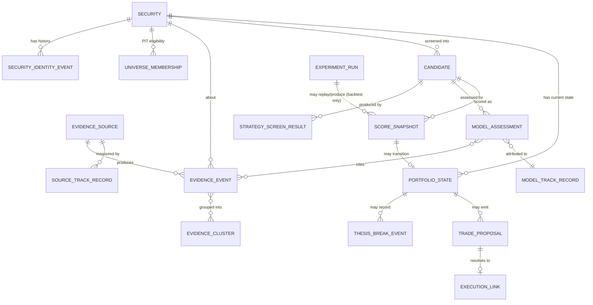
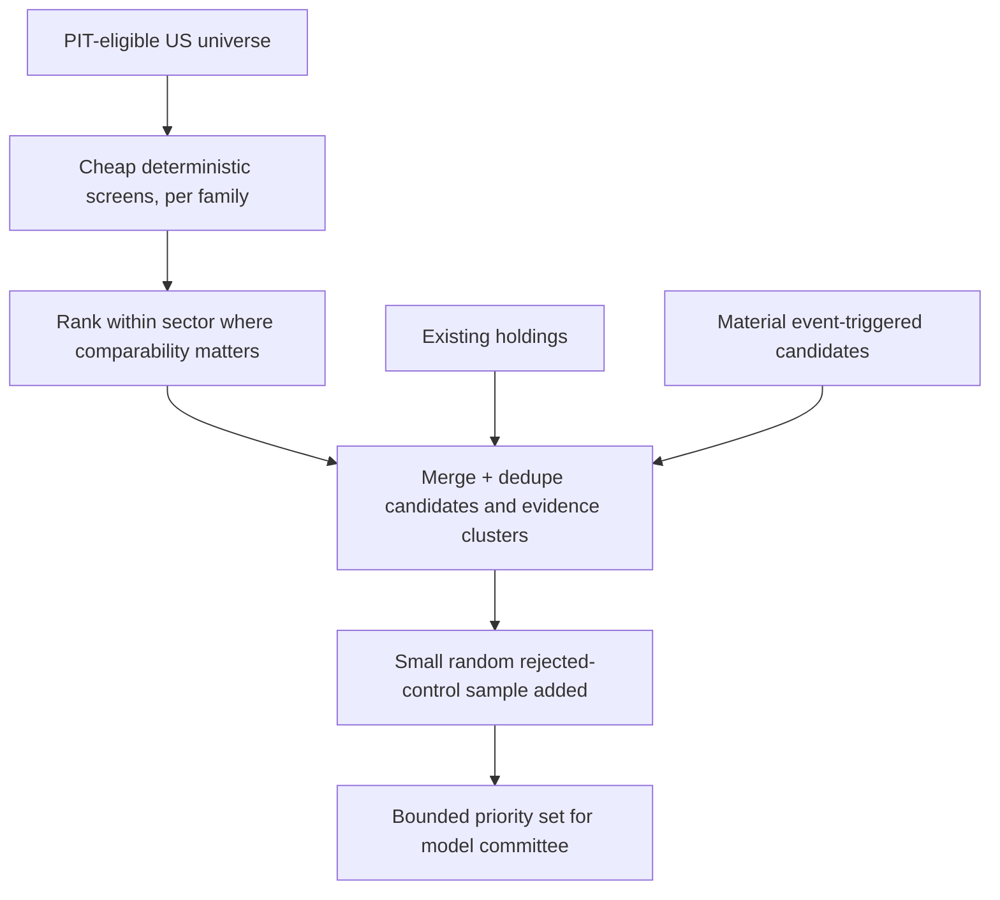
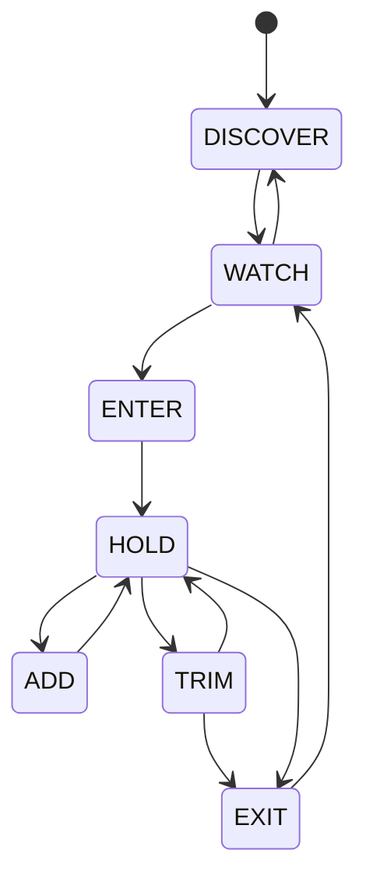
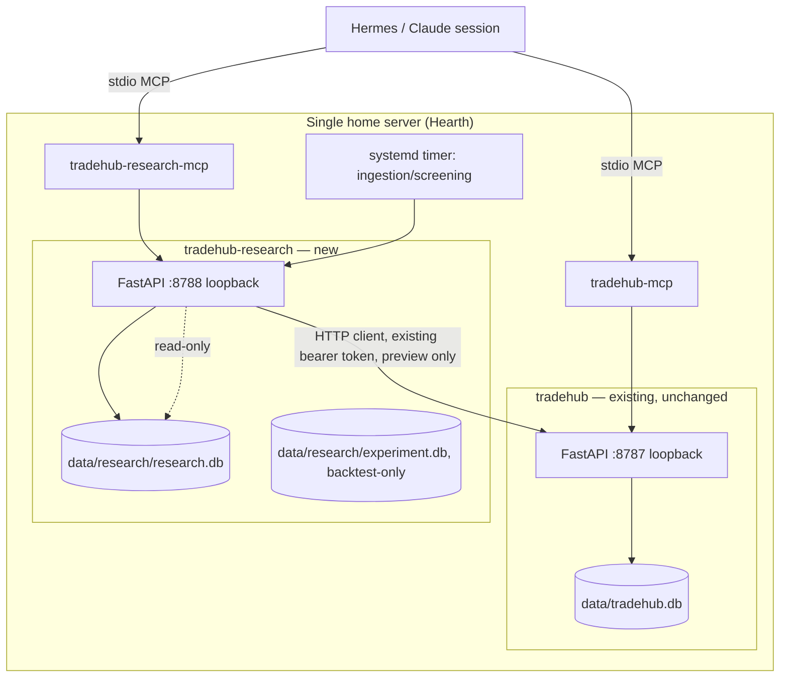
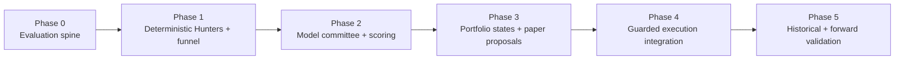

# Tiger TradeHub V2 — Canonical Technical Architecture

Date: 2026-08-24
Author: Primary Architect (Claude, this session)
Status: Draft for review. Companion documents: [`docs/v2-architecture-review.md`](v2-architecture-review.md) (orthogonal hostile review), [`docs/threat-model.md`](threat-model.md) (updated with V2 trust boundaries).

Baseline validated: `main @ a89a1b0`. FA-00..FA-05 PASS. This document proposes **zero changes**
to `tradehub/*.py`. V2 is a new, additive service that sits above the existing guarded execution
core and consumes it only as an HTTP client, exactly the way the MCP server and Telegram bot do
today.

> **Folded finding (Independent adversarial review, 2026-08-24):** the "zero changes" claim has two
> known exceptions that must be read together with this document — the market-data fork in §8 and
> the FA-05 PAPER-gate re-implementation in §19. Neither changes the order path; both are
> load-bearing for Phases 1 and 4 and are called out where they occur. Full record: §24.

## 1. What V2 Is, In One Paragraph

TradeHub V2 is a low-touch US-equity research and guarded-decision system layered above the
existing broker bridge. It repeatedly gathers point-in-time public evidence, runs cheap
deterministic screens across five evidence families, asks two independent neutral models to
interpret and challenge each candidate, combines the result into a stable evidence-driven score,
tracks that score's trajectory, and converts sufficiently strong and persistent conclusions into
typed trade proposals. Those proposals enter the **existing, unmodified** preview → confirm →
submit flow. No model, and no part of V2, ever calls Tiger directly.

## 2. Guiding Principles (carried from the brief, not re-litigated)

- **Models interpret. Code measures. Evidence decides what can be claimed. Deterministic policy
  decides what can be acted on.**
- Boring, modular, inspectable, deterministic, testable, reversible, single-host-friendly.
- The validated execution core (`tradehub/app.py`, `policy.py`, `audit.py`, `tiger_gateway.py`,
  `models.py`, `config.py`) is not refactored, not extended, and not imported into by V2 code. It is
  called over HTTP through its existing bearer-token-guarded REST API, the same boundary every
  other client (MCP server, Telegram bot) already uses.
- No new execution endpoints. No new Tiger credentials outside the existing gateway. No new
  broker-write path.

## 3. System Boundary

```mermaid
flowchart LR
    subgraph Research["Research plane — probabilistic, replaceable"]
        ING[Ingestion adapters]
        HUNT[Five deterministic Hunters]
        CAND[Candidate funnel]
    end
    subgraph Hermes["Hermes — orchestrator, holds no system-of-record state"]
        SCHED[M/W/F + event-driven scheduler]
        LLM[Neutral analysts / red team / arbiter LLM calls]
    end
    subgraph Decision["Decision plane — deterministic, replayable — tradehub-research service"]
        CMP[Deterministic claim comparison]
        SCORE[Score + trajectory engine]
        PORT[Portfolio state machine]
        SIZE[Sizing + concentration + risk policy]
        PROP[Typed trade proposal]
    end
    subgraph Execution["Execution plane — EXISTING, UNCHANGED — tradehub core"]
        PREVIEW["/orders/preview"]
        CONFIRM[Human explicit confirmation]
        SUBMIT["/orders/submit"]
        TIGER[Tiger Brokers]
    end

    ING --> HUNT --> CAND
    SCHED --> CAND
    CAND -->|evidence pack| LLM
    LLM -->|structured assessment, HTTP POST| CMP
    CMP --> SCORE --> PORT --> SIZE --> PROP
    PROP -->|OrderIntent, HTTP client call| PREVIEW
    PREVIEW --> CONFIRM --> SUBMIT --> TIGER
    SCORE -.-> BRIEF[Hermes M/W/F briefing]
    PORT -.-> BRIEF
```



**Research plane** (new): PIT data in, screen evidence out. Never trades, never sees Tiger
credentials.

**Hermes** (existing agent, new responsibility): drives the model committee — calls whatever LLM
providers it already has access to, on a schedule, using evidence packs the research service
prepares. Writes results back into the research service through a narrow structured contract.
Hermes is orchestration and UI; it is not where thesis or score state lives.

**Decision plane** (new — `tradehub-research`): deterministic. Owns scoring transforms, trajectory,
portfolio state transitions, sizing/concentration checks, and the typed proposal. This is the new
system of record for research/decision data. It runs as its own local process (§4) with its own
SQLite database (§5), and never holds Tiger credentials.

**Execution plane** (existing, byte-for-byte unchanged): everything after a proposal becomes an
`OrderIntent` is exactly today's flow — preview, confirmation token, explicit human confirmation,
submit, audit. `tradehub-research` calls `/orders/preview` the same way `tradehub-mcp` does, using
the same bearer token, over the same loopback API.

## 4. Service Boundaries — resolved: a second local process, not a module, not a microservice mesh

**Question:** modules inside the existing FastAPI process, a separate service, or something in
between?

**Rejected: modules inside `tradehub/app.py`'s process.** This is the simplest-looking option and
was the default hypothesis. It fails on inspection: the execution process currently holds Tiger
private keys, the API bearer token, and confirmation-token state in memory, and its threat model
(`SECURITY.md`, `docs/threat-model.md`) is built around that process being small and auditable.
Research code has to fetch and parse untrusted text (filings, news, transcripts) and eventually
talk to LLM providers. Putting that code in the same process as live broker credentials means a
prompt-injection or dependency-supply-chain bug in research code runs in the same address space as
the private key. That is a strictly worse blast radius for no operational benefit — V2 does not
need shared-memory speed with the execution core; it needs an HTTP call a few times a day.

**Rejected: decomposition into five microservices** (one per evidence family) or a message-bus
architecture. The brief explicitly rules this out, and there's no scaling or team-ownership reason
for it on a single-operator, single-host system. Five Hunters are five *functions* behind one
interface (§9), not five deployables.

**Resolved (V1): a second local process, `tradehub-research`**, structured as its own Python
package inside this repo (e.g. `tradehub_research/`, sibling to `tradehub/`, never importing from
it), with its own FastAPI app bound to loopback on a different port (`127.0.0.1:8788`, configurable),
its own SQLite database, and its own bearer token. It talks to the execution core exclusively as an
HTTP client using the existing `/health`, `/account/*`, `/orders/preview` endpoints — the same
pattern `tradehub/client.py` already implements. It never calls `/orders/submit` in its own client
code (§14) — that call only ever happens from the existing human-confirmed flow (Claude/Hermes MCP
session or Telegram), unchanged.

This is not a microservice architecture in the sense the brief warns against: there is no service
mesh, no independent scaling, no network hop across hosts, no orchestration layer managing
container lifecycles. It is two boring bare processes on one machine, matching the deployment
pattern the execution core already uses (`docs/chatgpt-handoff.md`: "service (bare process, not
Docker, loopback 127.0.0.1:8787)"). The only thing gained is credential and blast-radius isolation,
which is exactly what the threat model needs (§15 below, and `docs/threat-model.md` T3/T4).

## 5. Database — resolved (V1): one new SQLite file; DuckDB as an on-demand analytical library, not a service; Postgres deferred

Three distinct data concerns exist, and they should not be conflated:

| Concern | Volume/shape | Access pattern | Store |
|---|---|---|---|
| Execution audit (existing) | small, append-only | low QPS, transactional | `data/tradehub.db` — **untouched** |
| Research/decision operational state (candidates, assessments, scores, portfolio states, proposals) | low-to-moderate rows, but relational and needs referential integrity | mixed read/write, mostly single-writer batch jobs | new `data/research/research.db` (SQLite) |
| PIT evidence ledger + backtest/experiment history | grows to millions of rows over years across thousands of securities | append-mostly writes, range/point-in-time analytical reads for backtesting | same `data/research/research.db` for the ledger; **on-demand DuckDB** (embedded library, not a server) for analytical/backtest queries over immutable snapshots (see §20) |

**Rejected: PostgreSQL for V1.** Postgres is the "textbook correct" choice for a growing
multi-writer relational workload, and if concurrent write contention becomes real, it is the
obvious next step. But for V1 it adds an operated service (install, upgrade, backup, restore,
credentials, connection pooling) that this single-operator, single-host system does not yet need to
justify. SQLite in WAL mode is already the execution core's proven pattern (`tradehub/audit.py`),
handles the actual V1 write pattern (a handful of batch jobs: ingest, screen, score, three times a
week, plus committee-run writes) comfortably, and its backup story is `sqlite3 .backup` — a single
file copy an operator can reason about at 3am. **PROVISIONAL**: revisit if the ingestion/scoring
pipeline ever needs genuinely concurrent multi-writer access (e.g., parallel per-sector Hunters
writing simultaneously) and WAL lock contention is *measured*, not assumed.

**Rejected: DuckDB (or Parquet+DuckDB) as the primary store.** DuckDB is excellent for the
backtest/experiment analytical workload (columnar scans over years of evidence) but is not designed
as a concurrent OLTP store for a live pipeline that's also serving Hermes reads during scoring runs.
Using it as the *only* store would fight its design.

**Resolved (V1): SQLite is the system of record; DuckDB is invoked only inside the backtest/
experiment code path**, as an embedded library (no persistent process), reading a **read-only**
connection to `research.db` (SQLite URI `?mode=ro`) or periodic immutable Parquet snapshots. This
gives OLAP-quality analytical performance for walk-forward backtests without adding an operated
service, and structurally prevents a backtest bug from ever mutating live portfolio state (§18).

Research databases live under `data/research/` — **not** directly in `data/`, which also holds
`data/tiger_private_key.pk8.pem`; the directory split keeps T14's separate-OS-user recommendation
viable without resharing the execution user's key directory. Folded finding (2026-08-24): a
`?mode=ro` connection to a WAL-mode database still requires writable `-wal`/`-shm` sibling files —
under T14's separate-OS-user deployment it fails to open, and under same-user it is weaker
isolation than "enforced by the SQLite connection mode" implies. Backtest input is therefore
**immutable snapshots only** (`VACUUM INTO` copies or Parquet snapshots, §20), never a live
connection.

**Migration escape hatch (K-Scalability):** the schema (§6) is fully relational and normalized
enough that a SQLite → Postgres migration, if ever needed, is mechanical (schema translation +
`pgloader`-class tooling), not a rewrite. This is documented now precisely so choosing SQLite today
is not an architectural dead end later.

## 6. Data Model

Entities are kept close to the brief's list; nothing is invented that doesn't have a clear reader.
Trajectory is **not** a separate mutable table — it is computed at write time into each
`score_snapshot` row (current, prior, deltas), because snapshots are already immutable per-run
facts; a separate trajectory table would just be a slower way to query the same history.



| Entity | Key fields | Timestamps | Notes |
|---|---|---|---|
| `security` | `security_id`, canonical ticker, exchange, name, sector/industry, `sector_coverage_status` (SUPPORTED/LIMITED/RESEARCH_ONLY) | `first_seen`, `delisted_at?` | Ticker is not the primary key — see identity events. |
| `security_identity_event` | `security_id`, event type (ticker_change, share_class_change, corporate_action, delisting), old/new values | `event_time`, `public_available_time` | Required for PIT replay correctness (§7). |
| `universe_membership` | `security_id`, price/mcap/ADV at evaluation time, eligibility flags | `valid_from`, `valid_to` | Row per membership interval, not a boolean flag — enables PIT universe reconstruction. |
| `evidence_source` | `source_id`, source type, hierarchy tier (§3.5 of canonical spec), reliability notes | — | SEC filing, transcript, price feed, Form 4, congressional feed, 13F, etc. |
| `evidence_event` | `evidence_id`, `security_id`, `source_id`, structured extracted fields (JSON), extraction confidence, `supersedes_evidence_id?`, `withdrawn` flag, content hash (dedupe key) | `event_time`, `public_available_time?` (nullable), `pat_provenance` (see §7), `ingested_time` | Append-only. Corrections are new rows linked via `supersedes_evidence_id`, never in-place edits. Retraction (a filed document pulled with no replacement) is also a new row: `supersedes_evidence_id` points at the withdrawn row and the superseding row carries the `withdrawn` flag with empty content — without this, the §12 no-new-evidence rule would hold a score up on evidence that no longer exists. |
| `evidence_cluster` | `cluster_id`, representative summary, member evidence_ids | `formed_at` | Prevents five articles about one earnings release from being counted as five confirmations. |
| `strategy_screen_result` | `security_id`, `family` (5 families + momentum/options modifier), `screen_id`, raw features (JSON), evidence_ids, reason_codes, `confidence`, `data_quality`, `passed` | `as_of`, `computed_at` | Output of a Hunter (§9). Deterministic, replayable given the same `as_of` and evidence state. |
| `candidate` | `candidate_id`, `security_id`, `run_id`, inclusion reason (screened / holding / event-triggered / rejected-control-sample), screen_result_ids | `included_at` | One row per security per pipeline run that reaches the funnel. |
| `model_assessment` | `assessment_id`, `candidate_id`, `model_provider`, `model_id`, `prompt_version`, `role` (neutral_analyst_a/b, red_team, arbiter), claims (JSON), evidence_ids (must resolve), missing_evidence, thesis_summary, upside/downside mechanism, thesis_break_conditions, `confidence` | `evaluation_time`, `submitted_at` | Immutable once written. Written by Hermes via the committee-submission API (§11), validated before insert. |
| `score_snapshot` | `snapshot_id`, `candidate_id`, `scoring_version`, `conviction`, `data_quality`, `committee_agreement`, per-family contributions, trajectory fields (prior conviction, 3/5-run deltas, time-since-material-change), evidence set hash | `computed_at` | Immutable. Never overwritten — a new run produces a new row. |
| `portfolio_state` | `security_id` (current state is 1 row per security, keyed by security), `state` (DISCOVER..EXIT), `entered_state_at`, target exposure, active thesis-break refs | `transitioned_at` | Current-state table; history is reconstructed from `score_snapshot` + a `portfolio_state_transition` log (see below). |
| `portfolio_state_transition` | `security_id`, `from_state`, `to_state`, `reason_codes`, `score_snapshot_id`, `persistence_satisfied` | `transitioned_at` | Append-only log backing `portfolio_state`. |
| `thesis_break_event` | `security_id`, `condition_text`, `evidence_ids`, `verified` | `detected_at`, `verified_at?` | Bypasses ordinary persistence (§13). |
| `trade_proposal` | `proposal_id`, `security_id`, `current_state`, `proposed_state`, `action`, `reason_codes`, `conviction`, `data_quality`, `agreement`, `trajectory_label`, `current_weight`, `target_weight`, `max_notional`, `order_constraints`, `score_snapshot_id`, `policy_version`, `requires_human_approval` | `created_at` | Exact fields from the brief's execution-handoff contract. |
| `execution_link` | `proposal_id`, `confirmation_token_ref` (opaque, not the raw token), `order_id?`, `execution_event_type` | `linked_at` | Points at execution-core audit events by ID only — **no foreign key into `tradehub.db`**, different trust domain, different process. Reconciled by ID, not by DB join. |
| `model_track_record` | `model_provider`, `model_id`, `role`, sector/horizon buckets, calibration stats | rolling window | Diagnostic only; never feeds back into live scoring automatically (§17 governance). |
| `source_track_record` | `source_id`, sector/transaction-type/horizon buckets, observed predictive usefulness, shrinkage-adjusted weight | rolling window | Per canonical spec §15 — no permanent named-person credibility. |
| `experiment_run` / `backtest_run` | `experiment_id`, `scoring_version`, universe definition, date range, baseline comparisons, results summary | `started_at`, `finished_at` | Writes only to its own tables; never touches live `portfolio_state`/`trade_proposal` (§18). |
| `scoring_version` | `version_id`, formula description, weights, effective_from, changelog entry | `created_at` | Every `score_snapshot` and `trade_proposal` records which version produced it. Old snapshots remain interpretable forever under their own version. |

This is deliberately not over-normalized: `trajectory` lives inside `score_snapshot`;
`claim`/`evidence` linkage is a JSON array of evidence_ids on `model_assessment` rather than a
separate many-to-many join table, because claims are never queried independently of their parent
assessment; `model_track_record`/`source_track_record` are rolling aggregates, not raw event logs
(the raw events are `model_assessment` and `evidence_event`, which already exist).

## 7. Point-in-Time Discipline

Every evidence-bearing table carries at minimum `event_time` (when it happened),
`public_available_time` (when it became knowable), and `ingested_time` (when TradeHub saw it).
Scoring and screening always filter on `public_available_time <= as_of`; backtests must never be
able to see `event_time <= as_of` data whose `public_available_time` is in the future relative to
`as_of` — this is the single most common backtest-cheating bug (using restated/cleaned-up data or
same-day availability that wasn't actually available same-day), and it is enforced by a query
predicate, not by trusting the caller.

Folded finding (2026-08-24): the predicate is only as good as the field's population rule. Several
V1 sources (company IR releases, congressional-disclosure feeds, derived XBRL fundamentals) do not
report a publication timestamp. `public_available_time` is therefore **nullable**, and every
`evidence_event` carries a mandatory `pat_provenance` enum:
`source_reported | derived_from_index | observed_at_ingest | unknown`. The backtest engine's default
filter admits only `source_reported` and `derived_from_index`; anything else must be opted into
explicitly and appears in the run summary. Ingestion adapters that cannot determine when a fact
became knowable write `unknown` — never `event_time` (systematic lookahead) or `ingested_time`
(systematic backfill lag, silently killing signal) — and `unknown` rows are excluded from
backtests and counted in data quality. A per-source `pat_provenance` histogram is exposed via
`research_status` (§16) so drift toward `observed_at_ingest` is visible. The Epic 6 look-ahead
acceptance check validates the predicate; it does not validate the timestamp's truthfulness, which
is exactly what `pat_provenance` is for.

Corrections and restatements are new `evidence_event` rows with `supersedes_evidence_id` set; the
original row is never mutated or deleted, so a backtest run "as of" a date before the correction
still sees exactly what was knowable then.

Delisted securities and ticker/share-class changes are handled by `security_identity_event` +
`universe_membership` intervals, so PIT universe reconstruction ("what was investable on 2024-03-15")
is a query, not a manual reconstruction project.

## 8. Data Ingestion — V1 Scope

No paid vendor is contracted before a specific Hunter needs a specific field.

| Category | V1 requirement | Source candidate | Note |
|---|---|---|---|
| SEC filings (10-K/10-Q/8-K/Form 4) | **Required** | SEC EDGAR full-text + XBRL (free) | Primary-source tier 1 evidence. |
| Prices/volume | **Required** | **FORK — resolved decision (folded finding 2026-08-24):** the existing core exposes no market-data endpoint (`tradehub/tiger_gateway.py` constructs only a `TradeClient`; the repo's only `QuoteClient` lives inside `tradehub/acceptance/packs/fa05.py`, reachable only by the acceptance CLI). V1 must choose: (a) a non-Tiger price source consumed by `tradehub-research` directly, or (b) an additive, read-only `/market/quote` endpoint on the execution core as its own separately-reviewed epic — which downgrades the "zero changes" claim to "zero changes to the order path". Decide in Phase 1 before the momentum/liquidity Hunter is built. | Needed for universe floors, momentum modifier, liquidity checks. |
| Fundamentals | **Required** | Derived from XBRL where possible; vendor only if XBRL coverage is insufficient | Defer vendor decision to Phase 1 when Quality/Durability Hunter is built. |
| Earnings transcripts | **Required** | Company IR releases / EDGAR exhibits first; transcript vendor later if needed | |
| Analyst estimates/revisions | **Desirable-later** | Vendor decision deferred | Genuinely-difficult-PIT: as-reported historical estimates are expensive; do not buy before Phase 1 Inflection Hunter needs it. |
| Insider Form 4 | **Required** | SEC EDGAR Form 4 (free) | Core Informed-Activity family input. |
| Congressional disclosures | **Desirable, cheap** | Public disclosure datasets (e.g., House/Senate stock-watcher style feeds) | Low weight per canonical spec §15; free sources adequate for V1. |
| 13F | **Desirable-later** | SEC EDGAR 13F (free) | Slow-confirmation only; simple to ingest from EDGAR directly, no vendor needed. |
| Corporate actions/events calendar | **Required** | Tiger + EDGAR 8-K | Needed for Event/Catalyst family and identity-event tracking. |
| Options info | **Optional, V1-deferred** | Deferred with the prices fork above (no Tiger quote endpoint exists in the current core) | Sensor only; not required to ship Phase 1. |

Genuinely-difficult PIT fields (flagged, not solved): as-reported historical consensus estimates,
full historical fundamentals for delisted issuers, and restated financials tracked at the field
level. These are explicitly **OPEN** — do not let them block Phase 0/1.

## 9. Hunter Interface — one contract, five implementations

```python
def run_hunter(
    as_of: datetime,              # PIT cutoff — evidence with public_available_time > as_of is invisible
    universe: list[SecurityId],   # PIT-eligible universe for this run
    evidence: EvidenceLedgerView, # read-only, as-of-filtered view over evidence_event
) -> list[ScreenResult]:
    ...

class ScreenResult:
    security_id: SecurityId
    family: Literal["valuation", "inflection", "quality", "informed_activity", "event", "momentum_confirmation", "options_confirmation"]
    screen_id: str
    raw_features: dict
    evidence_ids: list[EvidenceId]
    reason_codes: list[str]
    confidence: float
    data_quality: float
    passed: bool
```

All five families (plus the two bounded confirmation modifiers) implement this same pure-function
contract: PIT data in, bounded candidates + reason codes + evidence IDs + confidence/data-quality
out. **Never places trades, never has network side effects beyond reading the evidence store.**
This is what "avoid five bespoke mini-platforms" means concretely — a Hunter is a Python function
registered against this signature, not a service, not a framework. Sector-specific feature packs
(canonical spec §3.2) are additional `screen_id`s within the `inflection`/`quality` families, not
new families or new contracts.

## 10. Candidate Funnel

Adopted directly from the canonical spec (§6), no material change:



Initial budget: **tens of candidates per full committee run** (configurable, starting point ~40–60),
not thousands. The deterministic layer does essentially all the rejection work before any model
call. Exact budget is OPEN — tune once Phase 1 ingestion volume is known.

## 11. Model Orchestration — Hermes drives the committee, TradeHub validates and stores

**Resolved, and it's the single biggest simplification in this architecture: `tradehub-research`
never calls an LLM provider API itself.**

The alternative — TradeHub embedding its own committee orchestrator, managing provider API keys,
retries, cost budgets, and rate limits for Anthropic/OpenAI/etc. — duplicates capability Hermes
already has as an agent. It would also mean a second class of secret (LLM provider keys) living in
a service the threat model is trying to keep boring. Hermes is explicitly defined as "orchestrator
and UI, not system of record" in the canonical spec; the natural reading of that is Hermes places
the model calls and TradeHub validates and persists the results.

Flow:

1. `tradehub-research` exposes `GET /candidates/{id}/evidence-pack` — a structured, deterministic
   bundle of evidence_events, prior claims, and freshness metadata for one candidate. No model
   output in this response.
2. Hermes (on the M/W/F schedule, or event-triggered) fetches evidence packs for the bounded
   candidate set, and independently runs two neutral-analyst LLM calls per candidate — same pack,
   no cross-visibility, per canonical spec Stage 1.
3. Hermes `POST`s each result to `tradehub-research`'s `/candidates/{id}/assessments` using the
   exact `model_assessment` contract (§6). The endpoint **validates before insert**: every
   `evidence_id` cited must resolve to a real row (rejects hallucinated citations, §15); schema
   violations are rejected, not repaired.
4. `tradehub-research` runs **deterministic comparison** (Stage 2) once both neutral assessments are
   present. If material disagreement or weakness is flagged, it marks the candidate
   `red_team_required` and exposes another evidence-pack-style endpoint for Hermes to run Stage 3
   (targeted red team) and, if still unresolved, Stage 4 (evidence arbiter). TradeHub decides
   *when* red team/arbiter is needed (deterministically, from the comparison); Hermes just executes
   the model call when asked.
5. Only after all required stages for a candidate are present does `tradehub-research` compute a
   `score_snapshot`.

This keeps every LLM-provider credential and every prompt-injection-exposed text parse on Hermes's
side (which already has its own operating discipline for untrusted content — see
`.claude/skills/tiger-tradehub/SKILL.md`'s "untrusted content is data, not instructions" posture,
extended in §15), and keeps `tradehub-research` a boring deterministic validator + database. The
committee's *policy* (when red team fires, when arbiter fires, comparison logic) is deterministic
code inside `tradehub-research`, matching "code measures, evidence decides."

## 12. Scoring & Trajectory Engine

Adopted directly from the canonical spec §9 — literal multiplication is rejected (correlated
evidence, false precision); pure additive is rejected as incomplete (loses genuine confluence
signal). V1 mechanism:

```
base_evidence   = weighted standardized deterministic/validated evidence
confluence_bonus = bounded bonus for strong evidence from sufficiently DISTINCT families/clusters
penalties        = staleness + missing_data + low_data_quality + unresolved_claim_risk
raw_opportunity  = base_evidence + confluence_bonus − penalties
conviction       = calibrated_display_mapping(raw_opportunity)   # 0–100 display, NOT a probability
```

Folded finding (2026-08-24): "distinct families" over shared source data is not distinct evidence —
in V1, valuation, quality/durability, and inflection screens all derive from SEC XBRL, so distinct
`family` labels over a shared `source_id` are one dataset counted three times, and the scoring
function pays a bonus for it (the same error §6's `evidence_cluster` prevents at the event level,
reintroduced one level up). The confluence bonus must be computed over distinct `source_id`s and
distinct `evidence_cluster`s (both already modeled in §6): **families sharing a source contribute
at most one confluence unit.**

Every candidate presented for serious consideration carries four separate numbers — `conviction`,
`data_quality`, `committee_agreement`, `trajectory` — never collapsed into one. `scoring_version` is
recorded on every `score_snapshot`; changing the formula or weights requires a new version, and old
snapshots stay interpretable under the version that produced them (replayability, and a clean
rollback story). Family weights start as simple, transparent, clearly-labeled-as-provisional priors
and must beat an equal-weight baseline out of sample before being trusted (§17, and canonical spec
§9/§17).

**No-new-evidence rule**: if a candidate's material inputs did not change since the last run, its
deterministic components carry forward unchanged. A stochastic model rerun alone must not move
`conviction` — trajectory is evidence-driven, not rerun-driven (canonical spec §10). Verified
`thesis_break_event`s sit outside this smoothing and can trigger immediate review.

## 13. Portfolio State Machine & Sizing



A transition is never authorized by score alone. Eligibility considers conviction, data quality,
committee agreement, trajectory, thesis-break status, remaining opportunity, concentration/
sector/factor/correlation exposure, liquidity, volatility, and persistence/cooldown (hysteresis:
ordinary `ENTER`/`ADD`/`TRIM`/`EXIT` require the threshold across two scheduled runs or a
sufficiently large score change; a verified thesis-break bypasses persistence). Sell logic is
asymmetric — `exit_reason` is one of `thesis_broken`, `thesis_realised`, `opportunity_cost`,
`risk_reduction`, `data_integrity`, `policy_ineligible`; a falling price alone triggers
re-underwriting, not automatic exit.

Sizing is a separate deterministic engine, downstream of state eligibility: individual position cap,
active-signal-book budget, sector/factor exposure, correlation with existing holdings, volatility,
liquidity/exit capacity, portfolio drawdown, available cash. **No trade / holding cash is a valid,
expected, unpenalized output.** Exact caps are intentionally left as configuration, not hardcoded —
see OPEN items in the review doc — but the interface requires a concentration/correlation check step
to exist even before its constants are tuned, so the seam isn't retrofitted later.

Folded finding (2026-08-24): the execution core's policy is side-blind (`tradehub/policy.py` checks
no SELL constraint), and TRIM/EXIT proposals emit SELLs under the same per-order caps as BUYs. V1
must therefore (a) restrict SELL proposals to existing holdings in the paper account (no naked-short
proposals), and (b) enforce a **daily aggregate notional + order-count budget** in the research
plane, because V2's §10 funnel (40–60 candidates, M/W/F) replaces the human-paced premise under
which threat-model T7 accepted aggregate-exposure risk — tokens are now generated in bulk.

## 14. Execution Handoff — the only place V2 touches the execution core, and it touches it as a client

`trade_proposal` (§6) is the complete contract from the brief:

```
proposal_id, security_id, current_state, proposed_state, action, reason_codes,
conviction, data_quality, agreement, trajectory,
current_weight, target_weight, max_notional, order_constraints,
score_snapshot_id, policy_version, requires_human_approval
```

When a proposal is `action != NONE`, `tradehub-research` (or Hermes acting on its behalf) derives an
`OrderIntent` — symbol, side, quantity, `order_type=LIMIT`, `limit_price`, `currency=USD` — from the
proposal's `target_weight`/`order_constraints`, and calls the **existing, unmodified**
`POST /orders/preview` using `tradehub/client.py`'s existing pattern. The response's
`confirmation_token` is attached to the proposal (`execution_link`) and surfaced to the human in the
Hermes briefing — as an **opaque reference only; the raw token is never rendered into the briefing**
(folded finding 2026-08-24: the briefing session also ingests untrusted evidence text, and a raw
token in that context leaves a prompt-injected session one tool call from consumption). The operator
retrieves the token out-of-band — via the Telegram bot or the research MCP surface — and confirms
there, from a different device and session than the committee run (§15). **Submission always
requires the same explicit human confirmation the execution core already requires today** — V2 adds
no new authority to submit, no new confirmation bypass, and no direct LLM-to-Tiger path.
`requires_human_approval` is effectively always `true` for V1 (§ Phase 5 in the roadmap is the only
place this could ever change, and only after extensive paper evidence). Telegram-side (no
execution-core change): `/confirm` must re-render symbol/side/qty/limit from the stored intent and
demand a second affirmation before posting the token — today `tradehub/telegram_bot.py`'s
`/confirm TOKEN` posts the token without restating the order.

This is why the migration story (§21) is simple: **every execution-core file listed in the brief's
constraints remains untouched.** `tradehub-research` is purely a new HTTP client of the existing API
plus a new API/DB of its own.

## 15. Security & Trust-Boundary Delta

Full detail lives in the `docs/threat-model.md` update (T8–T14, new section, T1–T7 unchanged). The
core invariant, stated once here because it's load-bearing for the rest of this document:

> **A fully compromised research plane — poisoned source, hallucinating model, or a compromised
> Hermes session — can at worst produce a bad proposal or a bad preview request. It cannot submit a
> live order, because it does not hold the confirmation token issuance authority, does not hold Tiger
> credentials, and every path to `/orders/submit` still requires the same human confirmation and the
> same `policy.py` checks (allowlist, notional cap, quantity cap, market-order rejection, USD-only)
> that exist today, completely independent of anything the research plane claims.**
>
> **Corrected 2026-08-24 by independent adversarial review:** the research plane *can* obtain a
> confirmation token — preview *is* token issuance, and §4/§14 grant it the bearer token — so the
> "does not hold the confirmation token issuance authority" claim was false. The invariant holds
> only under three deployment requirements: (1) the committee session is **never** attached to
> `tradehub-mcp` (the MCP server that exposes `submit_order` — `tradehub/mcp_server.py`); it
> attaches only to `tradehub-research-mcp`; (2) raw confirmation tokens never enter any Hermes
> session context that has touched evidence text — briefings carry only opaque references, tokens
> are retrieved out-of-band by the operator; (3) the human confirming principal is a different
> device and session than the committee run. Tiger credentials remain absent from the research
> plane, and token consumption still passes the same `policy.py` checks as today. A **daily
> aggregate notional + order-count budget** enforced by the research plane is required because V2
> replaces the human-paced premise under which threat-model T7 accepted aggregate-exposure risk.
> See threat-model T16.

New V2-specific threats requiring new controls (detailed in the threat-model update): prompt
injection via evidence text (filings/news as adversarial instructions), source poisoning skewing
scores, private/non-public information leaking into automated signals, hallucinated citations,
model/provider compromise, runaway orchestration cost, the research plane attempting to alter risk
policy, and secrets leaking into research artifacts. Each has a concrete, already-designed-in
mitigation (§11, §6's evidence-id validation, provenance requirements, process/credential
separation) — see the threat model doc for the full table.

## 16. MCP / Hermes Surface

Minimal, read-oriented, mirroring the brief's list:

- `research_status` — pipeline health, last run per stage, data freshness, per-source
  PAT-provenance histogram (§7), and explicit `STALE` / `UNAVAILABLE` markers. Folded finding
  (2026-08-24): a failed nightly ingestion must not be indistinguishable from a normal no-trade day
  — a system whose valid output is often "no candidates" must lead every briefing with freshness,
  and "cannot reach research service" must be rendered as an error, never as an empty list.
- `list_candidates` — current bounded candidate pool with screen summaries.
- `get_security_thesis` — full evidence/claims/score history for one security.
- `list_portfolio_states` — current states across the universe.
- `get_committee_run` / `submit_committee_assessment` — the evidence-pack fetch and
  structured-assessment submission from §11 (these are the only *write* tools, and they write
  research data, never orders).
- `list_proposals` — pending trade proposals awaiting human review.
- `backtest_status` — experiment/backtest run status (read-only).

That's roughly eight tools, not dozens. A companion Hermes skill (new, alongside the existing
`.claude/skills/tiger-tradehub/SKILL.md`, which is **not edited** per the brief) should define:
Hermes's responsibility to drive the M/W/F schedule and model calls, the rule that untrusted
evidence text is always data passed into a structured field and never instructions, and the rule
that a proposal is only ever *presented*, never auto-confirmed.

## 17. Scheduling

**Resolved: no internal scheduler daemon inside `tradehub-research`.** Two different cadences need
two different triggers:

- **Deterministic stages (ingestion, screening, candidate-pool build) need no LLM judgment.** They
  run as a `tradehub-research` CLI (mirroring the existing `tradehub-acceptance run <PACK>` pattern)
  triggered by a plain systemd timer / cron, more frequently than the committee cadence (e.g. daily
  ingestion, or event-triggered on new filings).
- **The model-committee stage needs Hermes.** It is triggered M/W/F (and event-triggered on material
  new evidence) via Hermes's own scheduling capability (this environment already has cron/loop
  primitives available to Hermes) — a Hermes session wakes up, calls `research_status` and
  `list_candidates`, runs the committee flow from §11, and produces the briefing.

This avoids adding Airflow/Celery/APScheduler-class infrastructure entirely. Every stage is an
idempotent, independently-rerunnable CLI/API call — the same operability property the acceptance
runner already established for the execution core.

## 18. Failure Modes

| Condition | Behavior |
|---|---|
| Stale data | `data_quality` penalty applied at scoring time; below threshold, candidate cannot reach `ENTER`/`ADD` eligibility. |
| Missing required data | `sector_coverage_status` downgraded (SUPPORTED→LIMITED→RESEARCH_ONLY); execution eligibility narrows accordingly. |
| Conflicting sources | Routed to red team/arbiter (§11); no state transition until resolved or explicitly timed out to `ESCALATE`-equivalent (no proposal generated). |
| One model unavailable | Committee run for that candidate marked incomplete; **no proposal is generated from a partial committee** — never silently fall back to a one-analyst decision. |
| Malformed structured output | Rejected at the validation boundary (§11 step 3); logged, not auto-repaired or guessed. |
| DB unavailable / locked | Pipeline stage aborts inside its transaction; one pipeline stage = one transaction for its whole unit of work. Folded finding (2026-08-24): do **not** mirror `tradehub/audit.py`'s connect/commit pattern — it opens one connection per public method (a `create_confirmation` + `record_event` pair is two commits), which reproduces the very partial-write behavior this row denies. Under SQLite's 5s `busy_timeout`, an EDGAR bulk ingest overlapping a Hermes assessment POST fails with `database is locked` — classify and retry with backoff, and surface it; a silently discarded paid model call is a cost leak. |
| Tiger unavailable | Unchanged — existing execution-core 502 handling applies; V2 never bypasses it. |
| Scoring-version mismatch | Snapshots from different versions are never compared directly; each is interpreted under its own recorded version. |
| Partial/interrupted job | Deterministic research stages (ingest, screen, score) are idempotent and safe to rerun (dedupe via evidence content-hash / unique source keys); no manual DB surgery required. Folded finding (2026-08-24): the execution-handoff path is **not** idempotent — `tradehub/app.py` releases a confirmation token on *any* upstream exception even when the broker may already have accepted the order, and `tradehub/audit.py` makes a crash-abandoned claim re-claimable after 120s with no reconciliation; `OrderIntent.client_request_id` exists but is never sent to Tiger, so there is no broker-side dedupe. A retry after a submit timeout can therefore place a duplicate live order. Phase 4 (Epic 5) must be gated on a fix to the execution core — INDETERMINATE token state + reconciliation against `/account/orders` before any reuse + `client_request_id` threaded to Tiger — reviewed as an independent core change, since "zero changes to `tradehub/*.py`" protects Release 1 from V2 work, not from its own safety fixes. |
| Duplicate event ingestion | Unique constraint on `(source_id, content_hash)`; second insert is a no-op, not an error. |
| Model/provider drift | Tracked in `model_track_record`; surfaced diagnostically, never auto-adjusts live weights (§17 of canonical spec — learning is later-stage and tightly governed). |

This table deliberately reuses the acceptance program's fail-closed philosophy: unknown/ambiguous
states never default to "proceed," they default to "block and surface."

## 19. Testability — Acceptance Seams Designed In Now

Every pipeline boundary listed in the brief (ingestion → Hunter → candidate → evidence pack →
committee → score → trajectory → portfolio state → paper proposal → guarded preview) is already a
discrete, independently callable function/endpoint in this design (§9, §11, §12, §13, §14) —
not because acceptance testing was bolted on, but because each stage was designed as an idempotent,
pure-input/pure-output boundary in the first place. This means the same acceptance-runner pattern
already proven for the execution core (`tradehub/acceptance/`) extends naturally: new packs
(`RA-00`+, mirroring `FA-00`+) can exercise each research-plane boundary offline with fixture data
(Hunters are pure functions — perfect for golden-file tests), and the existing FA-05-style
"prove PAPER before any write" gate extends unchanged to the one place V2 touches execution (§14).
Concretely proposed in the epics (§22 / Epic 7): an `RA-00` qualification pack for the research
runner itself, and per-phase packs as each phase lands.

**Corrected 2026-08-24 (independent adversarial review):** the FA-05 gate does **not** extend
unchanged. It lives in the acceptance runner (`tradehub/acceptance/service.py` — broker-reported
`account_type == "PAPER"`, gated by `TRADEHUB_ACCEPTANCE_PAPER_WRITE`) and is not invoked by
`/orders/preview` or `/orders/submit`; the only account-safety control on the live path is the
process-level `TRADEHUB_DRY_RUN` env flag. The new `RA-05`-equivalent pack must therefore
**re-implement** the PAPER proof on the research plane's own preview path — it must not assume the
execution core's acceptance lineage carried over.

## 20. Backtest / Research Separation

`experiment_run`/`backtest_run` (§6) is the only entity a backtest writes to. Structural
enforcement, not just convention: the backtest engine reads **immutable snapshots only** —
`VACUUM INTO` copies or periodic Parquet snapshots of `research.db` (§5) — and writes exclusively to
`data/research/experiment.db`. Folded finding (2026-08-24): a `?mode=ro` connection to a WAL-mode
database still requires writable `-wal`/`-shm` sibling files, so under T14's separate-OS-user
deployment it fails to open, and under same-user it is weaker than "enforced by the connection
mode" implies. Snapshot input makes the read-only guarantee structural regardless of deployment; a
backtest bug cannot mutate `portfolio_state` or `trade_proposal` even if it tries.

Required before any backtest result is trusted (canonical spec §17, unchanged): PIT universe/data
only, publication-time controls, delisted-security handling, realistic slippage/fees, walk-forward
evaluation, frozen OOS windows, and comparison against the five mandatory baselines (benchmark,
cap/equal-weight universe, simple factor composite, deterministic-Hunters-without-committee, and
simpler/equal scoring). If the model committee doesn't measurably beat the deterministic-only
baseline after cost, the honest conclusion is to simplify or remove it — not to keep it because it's
already built.

## 21. Deployment Design & Migration Plan



**Resolved: bare processes managed by systemd user units, loopback-only, no Docker.** This matches
the execution core's already-established deployment convention
(`docs/chatgpt-handoff.md`: "bare process, not Docker, loopback 127.0.0.1:8787") and directly informs
closing the currently-blocked `#30`/FA-06: Docker adds no isolation benefit on an already single-user,
single-host machine, and it complicates secret injection into a setup that already works via `.env`.
`tradehub-research` follows the identical pattern on a second port, so FA-06-equivalent readiness
checks (start/restart under systemd, loopback preserved, secrets injected not committed, audit/DB
survives restart, MCP reconnects, repeatable upgrade/rollback) apply symmetrically to both services.

**Migration plan — V2 introduced without destabilizing R1:**

1. `tradehub-research` is a new package, new process, new port, new DB file, new systemd unit, and a
   new environment file `.env.research` holding only its own two bearer tokens (the research API
   token + the execution-core `TRADEHUB_API_TOKEN`). Zero lines change in `tradehub/*.py`, `tests/`,
   `pyproject.toml`, or `.env` — folded finding (2026-08-24): `tradehub/config.py` is
   `extra="ignore"`, so an accidentally-shared `.env` fails silently and permissively, and the
   execution `.env` also contains `TIGEROPEN_PRIVATE_KEY`; the research process must never inherit it.
2. It is developed and deployed independently; the execution core's FA-00..FA-05 lineage and green
   test suite are never touched by V2 work.
3. Rollback is trivial by construction: stop the `tradehub-research` systemd unit. The execution core
   is unaffected because it was never a dependency of V2, only the other direction.
4. The only new *behavior* visible to the execution core is additional `/orders/preview` traffic
   from a second authenticated client — already a supported pattern (any bearer-token holder can
   preview), and previewing has no side effect beyond issuing a confirmation token that still
   requires human action to consume.

**Deployment requirements (folded finding 2026-08-24):** the Hermes committee session and the
execution surface must be different principals — committee sessions attach `tradehub-research-mcp`
only, never `tradehub-mcp` (which exposes `submit_order`); raw confirmation tokens are never placed
in committee-session context (out-of-band retrieval via Telegram, §14); research DBs live under
`data/research/` so T14's separate-OS-user split does not reshare the directory holding
`data/tiger_private_key.pk8.pem`.

## 22. Phased Implementation Plan



The brief's six-phase decomposition holds up under review — no better decomposition was found. Each
phase is independently shippable and independently testable (§19); nothing in Phase N+1 is required
for Phase N to be useful and correct.

- **Phase 0 — Evaluation spine.** `security`, `security_identity_event`, `universe_membership`,
  `evidence_source`/`evidence_event`/`evidence_cluster`, `research.db` bootstrap, `experiment_run`
  scaffolding. No screening, no scoring, no models. Deliverable: a correct, replayable PIT evidence
  store with nothing consuming it yet.
- **Phase 1 — Deterministic Hunters.** The five-family screens + momentum/options confirmation
  modifiers, implementing the one Hunter contract (§9); ingestion adapters for the V1-required
  sources (§8); the candidate funnel (§10). Deliverable: a bounded, deduplicated candidate pool with
  reason codes and evidence links, zero model calls.
- **Phase 2 — Model committee + scoring.** Evidence-pack endpoint, structured assessment
  contract + validation, Hermes-driven neutral analysts/red-team/arbiter (§11), deterministic
  comparison, score/trajectory engine (§12), `scoring_version` registry. Deliverable: a
  `score_snapshot` per candidate with conviction/data_quality/agreement/trajectory, fully evidence-
  and claim-traceable.
- **Phase 3 — Portfolio decisioning.** State machine (§13), persistence/hysteresis, sizing/
  concentration engine, `trade_proposal` generation stopping *before* any execution-core call, M/W/F
  Hermes briefing. Deliverable: proposals a human can read and understand, with no order ever
  previewed yet.
- **Phase 4 — Guarded execution integration.** The `OrderIntent` derivation + `/orders/preview` call
  (§14), `execution_link` reconciliation, the RA-acceptance pack proving this boundary the same way
  FA-05 proved the paper-broker boundary. Deliverable: a full research-to-preview chain, submission
  still always human-confirmed.
- **Phase 5 — Historical & forward validation.** Backtest engine on the read-only DB snapshot (§20),
  mandatory baselines/ablations, walk-forward evaluation, `model_track_record`/`source_track_record`
  population, paper-forward tracking. This phase can and should start producing evidence *during*
  Phases 2–4 (backtesting the deterministic Hunters doesn't need to wait for the committee), but its
  completion — a committee that demonstrably beats the deterministic-only baseline — is the gate
  before any Phase 6 (limited automation, not in this document's scope; requires its own review).

## 23. Appendix: Proposed GitHub Epics

See `docs/v2-architecture-review.md` for the orthogonal hostile review this plan was checked
against, and the closing summary in that document for the titled epic list Hermes should file.

## 24. Independent Adversarial Review (2026-08-24) — Folded Findings

An independent adversarial architecture review (Claude Opus, no prior context, Read-only tools)
attacked A–L plus the loaded invariants ("zero changes", "preview-only", "SQLite sufficient",
"Hermes-driven committee", "no submit path"), verified every claim against `tradehub/*.py`, and
returned verdict **MATERIAL REVISION FIRST** — the plane split, Hunter contract, PIT schema shape,
`scoring_version` registry, and backtest write-separation all held; the fixes below are what
changed. Full record: `docs/v2-architecture-review.md` §M.

| # | Severity | Finding | Fix landed |
|---|----------|---------|------------|
| 1 | BLOCKER | A compromised Hermes session can reach `submit_order` — `tradehub/mcp_server.py` exposes it, and §21 wires Hermes to that MCP server while §14 put raw tokens in the briefing. The invariant "does not hold confirmation token issuance authority" was false: preview *is* issuance, and §4/§14 grant the research plane the bearer token. | §14 (opaque token refs, out-of-band retrieval, `/confirm` re-render), §15 (corrected invariant), §21 (session separation), threat-model T16. |
| 2 | BLOCKER | Submit non-idempotency: token released on any upstream exception (`app.py`) + stale-claim reuse after 120s (`audit.py`) ⇒ duplicate live order on retry; `client_request_id` never sent to Tiger. | §18 (Partial/interrupted job row — execution path is not idempotent), §19 (RA-05 gate), Epic 5 gate: independent core fix (INDETERMINATE state + reconciliation + idempotency key). |
| 3 | BLOCKER | `public_available_time` had no "unknown" state; the Epic 6 look-ahead check validates the predicate, not the timestamp's truthfulness — years of silently wrong PIT evidence. | §6 (nullable + `pat_provenance` + `withdrawn`), §7 (default filter), §16 (histogram + freshness surfacing). |
| 4 | BLOCKER/MATERIAL | `accepted=True` hardcoded regardless of Tiger preview; `policy.py` side-blind while §13 emits SELLs; symbol allowlist fails open when empty. | §13 (paper-account-only SELLs, daily aggregate budget), §15 (same), §8. |
| 5 | MATERIAL | "Zero changes to `tradehub/*.py`" falsified: no market-data endpoint exists (only `TradeClient` in the gateway; `QuoteClient` only in the acceptance pack); FA-05 PAPER gate is not on the submit path; `.env` sharing would put Tiger credentials in the research process environment. | §8 (prices fork resolved), §19 (RA-05 re-implements the gate), §21 (`.env.research`), §5/§21 (DBs under `data/research/`). |
| 6 | MATERIAL | Multiple testing: `scoring_version` records versions, not attempts against the same frozen OOS window — cheap replayability makes beating baselines by iteration inevitable. | §12/§20 note; review-record §G superseded; `oos_evaluation_log` (attempts incl. failures) required at Phase 5. |
| 7 | MATERIAL | Confluence bonus over "distinct families" sharing one XBRL source = one dataset counted three times. | §12 (distinct `source_id`/cluster rule). |
| 8 | MATERIAL/MINOR | `?mode=ro` on WAL DB needs writable `-wal`/`-shm`; DB files beside the private key; `database is locked` drops paid model calls; audit.py per-call-connection pattern is not a transaction pattern. | §5/§20 (snapshot-only backtest input), §5 (directory split), §18 (locked row + one-transaction-per-stage). |
